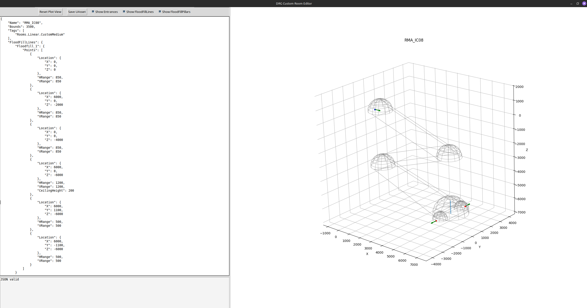
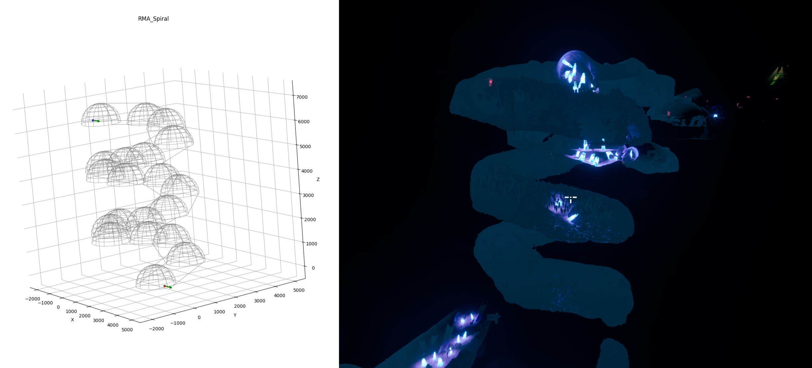
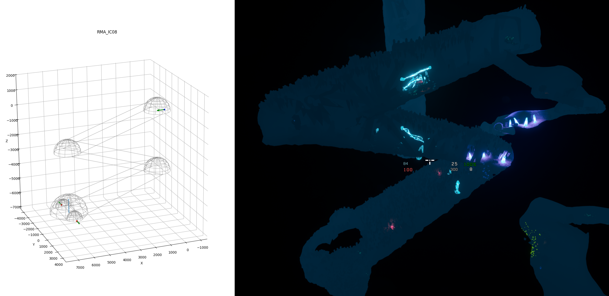
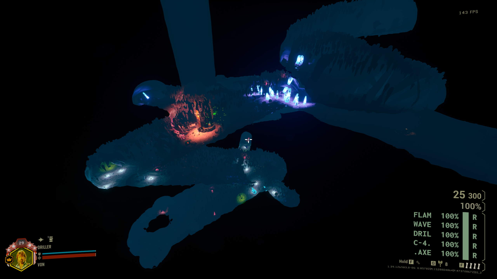

# DRG Room Editor manual

Welcome to the documentation for my [DRG Room Editor](https://github.com/vonacht/drg-room-editor/tree/main), a program that allows the creation of custom rooms for Deep Rock Galactic from JSON files. The editor includes a Python GUI for live editing and a GUI-less mode for batch conversion of files generated programmatically. The editor outputs a UAsset that can be packed into a mod (see `Usage`).

## Sections

* [Introduction](introduction.md): introduction to the editor and basic usage.
* [Room Features](room_parameters.md): description of the fields for each room feature.

## Small Showcase

