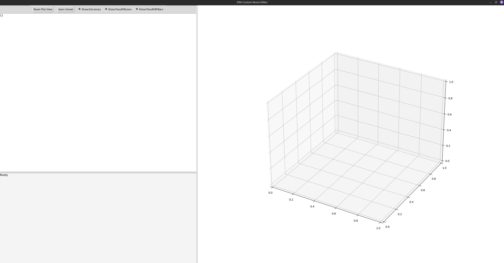
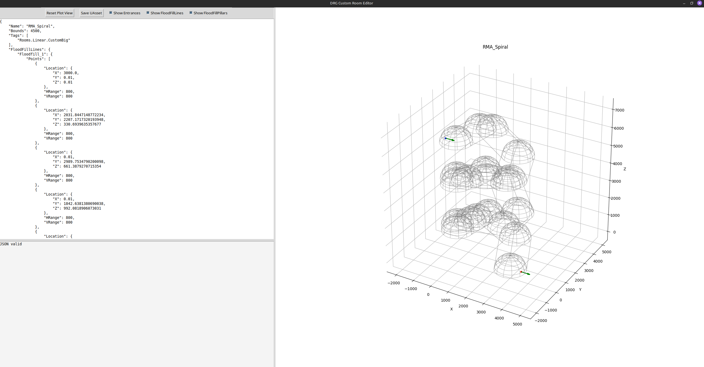
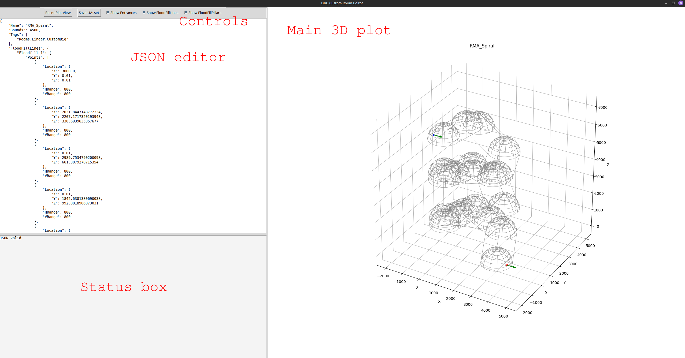

## Getting the editor
The code can be found in the [Github repo](https://github.com/vonacht/drg-room-editor/tree/main). The dependencies are managed with [uv](https://github.com/astral-sh/uv). After installing uv, clone the repo:

`git clone https://github.com/vonacht/drg-room-editor.git`

go into the project's directory and run the editor:

`uv run main.py`

The following command should fetch all the dependencies and start the editor with a blank plot:

You can also pass the path to an existing JSON file to open it:

`uv run main.py example_rooms/RMA_Spiral.json`

you can find many examples in `example_rooms/`.

## Basic Usage

The textbox on the right side contains the room JSON that is plotted on the right. A status box at the bottom warns you if the JSON is invalid or if it doesn't comply with the schema of a valid room (see [Room Features](room_parameters.md)). The control buttons at the top left corner, in order:

+ Reset Plot View: resets the axis position of the 3D plot. 
+ Save UAsset: will save the current JSON into a UAsset that can be packed into a mod. The files are saved in the `assets/` folder.
+ Show Entrances: shows the room entrances in the plot.
+ Show FloodFillLines: shows the `FloodFillLine` points in the plot.
+ Show FloodFillPillars: shows the `FloodFillPillars` in the plot.

## Batch mode
The editor can be run without the GUI by passing the `-b` or `--batch` flag together with the path of a directory. The program will do a non-recursive scan of the directory looking for JSON files and will attempt to convert them to UAssets in the `assets/` folder. Batch mode can be useful if you are generating rooms programmatically with a script. To test batch mode you can try:

`uv run main.py -b example_rooms/`
