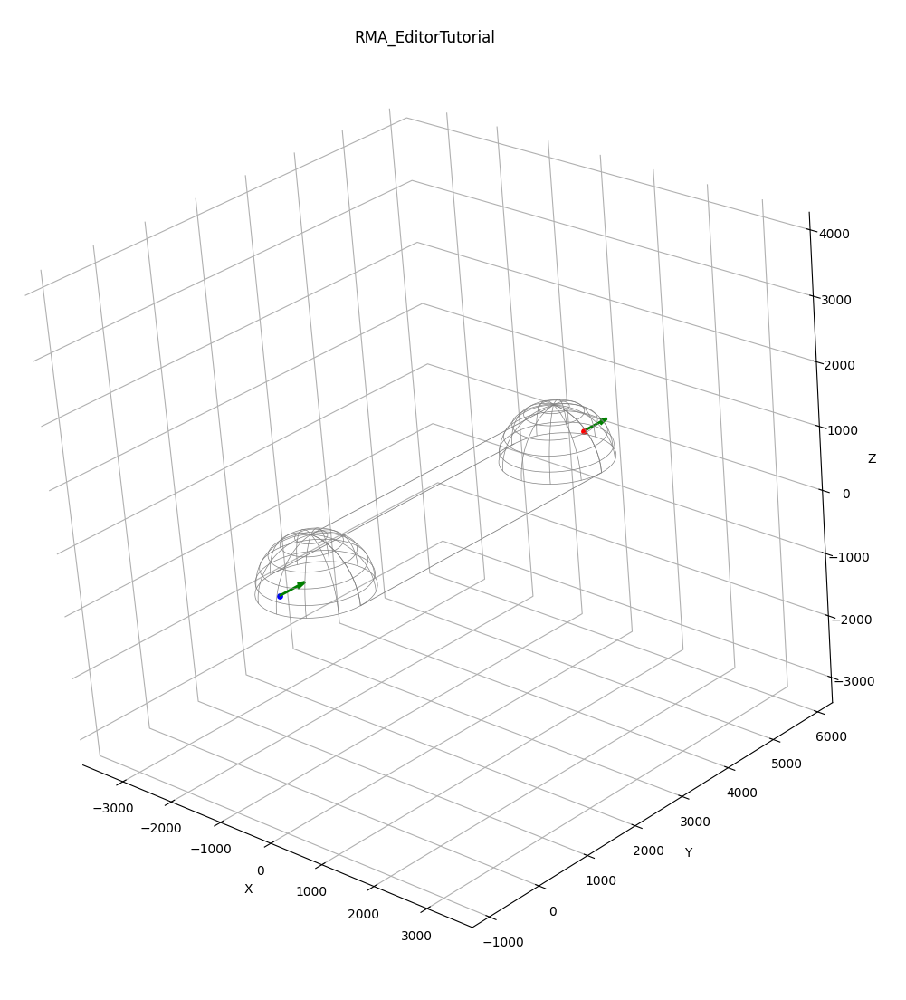
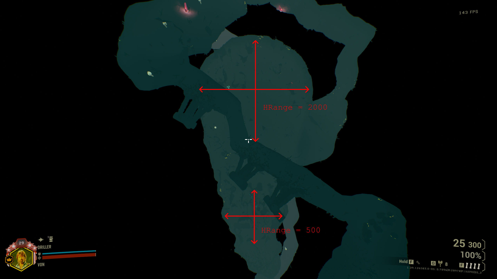
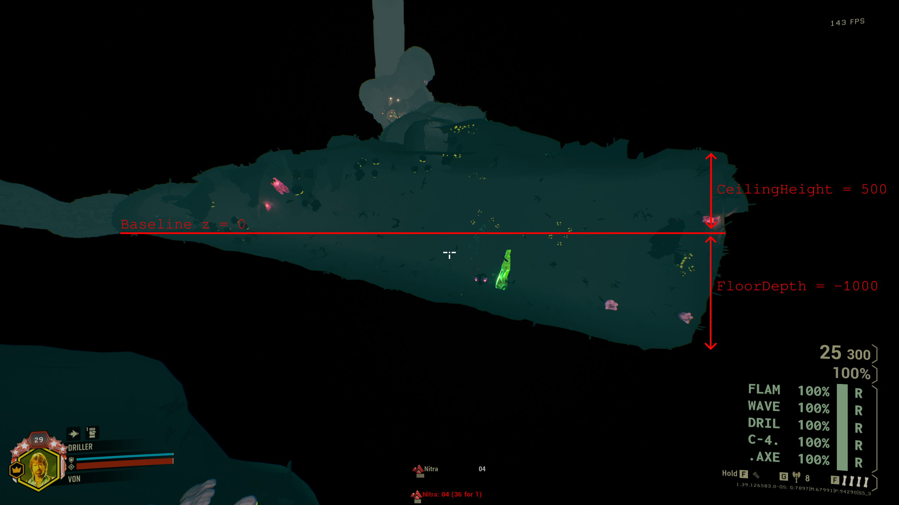
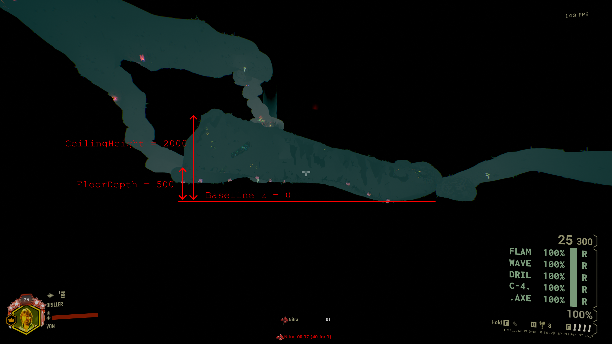
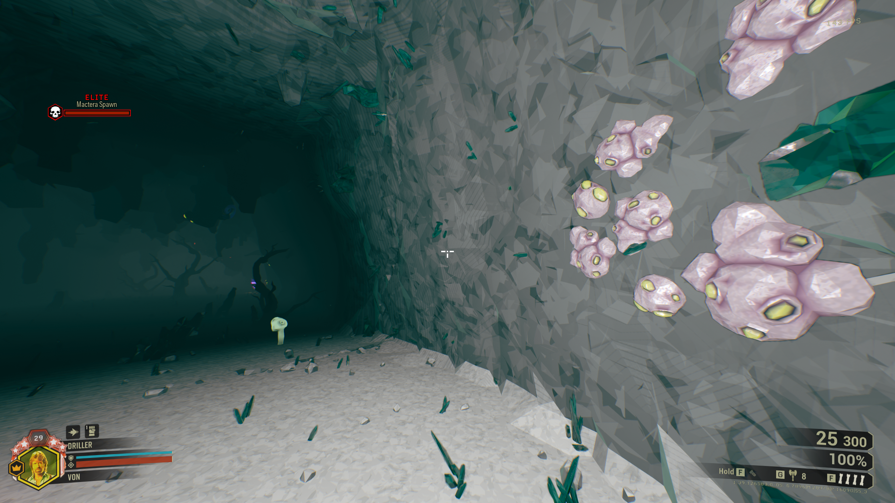
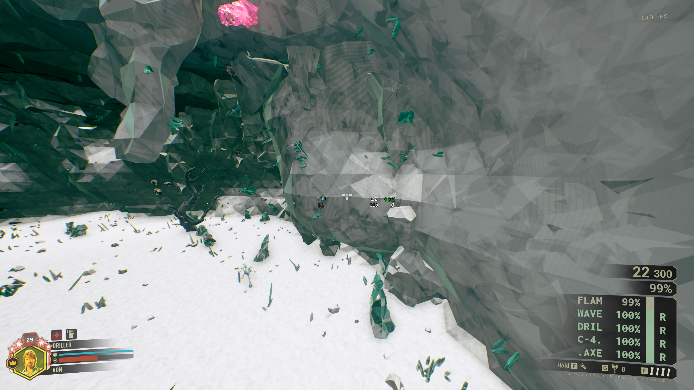
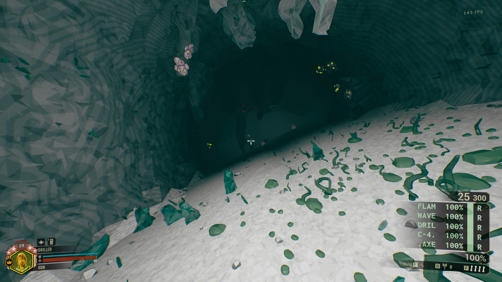
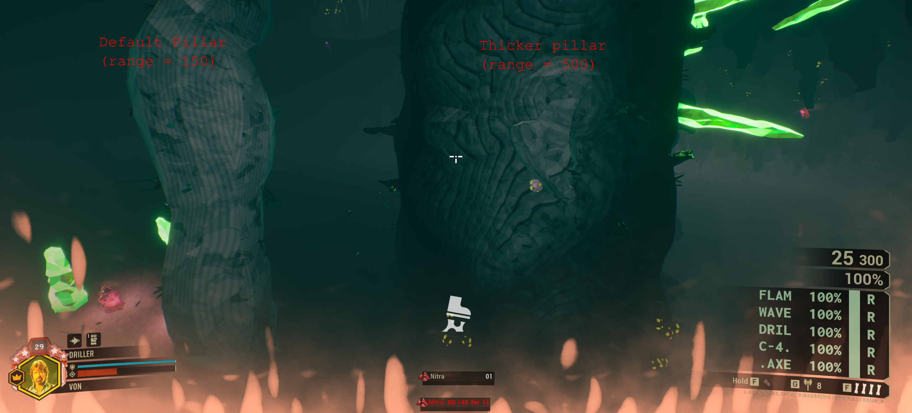
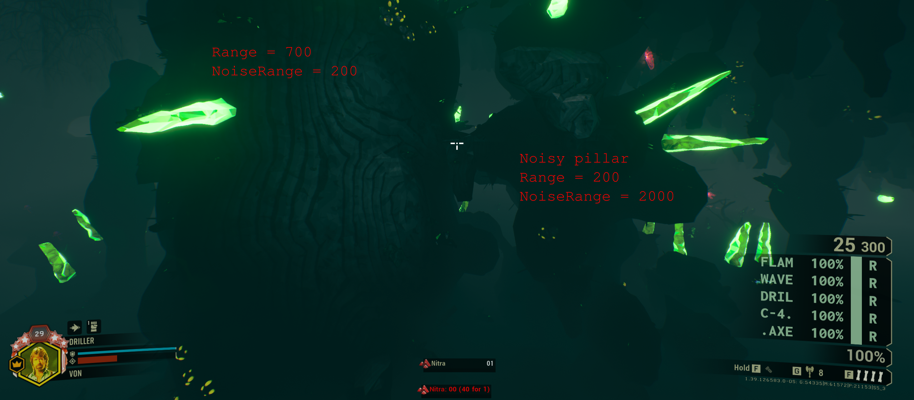

# Room Features
## Your First Room 

Rooms can have three different features:

* `FloodFillLines`: the basic unit of a room, it is made by a series of points that define semi-ellipsoids in 3D space. The game will connect all the points of a `FloodFillLine` by removing the material between them. A room can consist of as many `FloodFillLines` as you want.
* `Entrances`: points in 3D space with an associated vector which tell the game where to connect the room's entry and exit tunnels.
* `FloodFillPillars`: specified by a series of points in 3D space, the game will fill the resulting line with material. This is how the game implements decorations, bridges or the infamous finger cave. 

The editor will force the room JSON to have at least the `FloodFillLines` and `Entrances` fields, while pillars are optional. The simplest room you can create is a single `FloodFillLine` with two points, and two `Entrances` (one entrance and one exit):

```json 
{
    "Name": "RMA_EditorTutorial",
    "Bounds": 3500,
    "Tags": [
        "Rooms.Linear.CustomTest"
    ],
    "FloodFillLines": {
        "Floodfill_1": {
            "Points": [
                {
                    "Location": {
                        "X": 0,
                        "Y": 0,
                        "Z": 0
                    },
                    "HRange": 850,
                    "VRange": 850
                },
                {
                    "Location": {
                        "X": 0,
                        "Y": 5000,
                        "Z": 0
                    },
                    "HRange": 850,
                    "VRange": 850
                }
            ]
        }
    },
    "Entrances": {
        "Entrance_1": {
            "Location": {
                "X": 0,
                "Y": -700,
                "Z": 200
            },
            "Type": "Entrance",
            "Direction": {
                "Pitch": 0,
                "Yaw": 90,
                "Roll": 0
            }
        },
        "Entrance_2": {
            "Location": {
                "X": 0,
                "Y": 5600,
                "Z": 200
            },
            "Type": "Exit",
            "Direction": {
                "Pitch": 0,
                "Yaw": 90,
                "Roll": 0
            }
        }
    }
}
```

which produces the following cave:



The following sections contain all the implemented fields for each feature.

## FloodFillLines and FloodFillPoints
The `FloodFillLine` is the basic unit of a room. It is made of a series of `FloodFillPoints`. Points of the same line will be connected together by their tangent lines as shown in the visual editor, in the order they are specified. A room can have as many lines as desired, and a line must have a minimum of two points to be drawn by the game. Each point has the following parameters:

| Parameter | Required | Default | Comment |
| --------- | -------- | ------- | ------- |
| Location | Yes | N/A | Three values X, Y, Z which define the center of the point. |
| HRange | Yes | N/A | A float value that indicates the radius of the point in the XY plane. |
| VRange | Yes | N/A | A float value that indicates the maximum height of the point, see below in `Controlling Height`. |
| CeilingHeight | No | 900 | A float value that can make the room taller if positive, or shorter if negative. Values that result in a height larger than `VRange` will have no effect. |
| FloorDepth | No | 0 | A float value that will raise the floor if positive or lower it if negative. |
| FloorAngle | No | 0 | An angle value between 0 and 359 that adds the corresponding slope to the point. |
| FloorNoiseRange | No | 100 | A float value which, when increased, makes the floor rougher in texture. |
| CeilingNoiseRange | No | 100 | A float value which, when increased, makes the ceiling rougher in texture. |
| WallNoiseRange | No | 100 | A float value which, when increased, makes the walls rougher in texture. |
| HeightScale | No | 1 | Untested, but probably multiplies the room height. |

### Controlling the room size 

The main parameters for controlling the size are `HRange`, `VRange`, `CeilingHeight` and `FloorAngle`. To make a point wider or narrower in the XY plane, change its `HRange` value:



Controlling the height can be done in different ways. The easiest is to just use `VRange` and/or `CeilingHeight`: the height of the room will be the minimum of the two values (take into consideration that the default for `CeilingHeight` in the editor is 900). In addition, the `FloorDepth` parameter raises or lowers the floor starting at the Z coordinate of the point:


 In the case of the figure above, a negative value of `FloorDepth` creates a depression in the ground for the point on the right. A similar effect can be created by specifying a positive `FloorDepth` on the other point:



### Noise parameters
The `WallNoiseRange`, `CeilingNoiseRange` and `FloorNoiseRange` parameters all do the same thing: they make the texture of the walls, ceiling or floor smoother or rougher. For example, the following image shows the default value for `WallNoiseRange` = 100:




While the following image shows the effect of setting `WallNoiseRange` = 700:



### Sloped rooms
The `FloorAngle` parameter adds a slope corresponding to the specified angle. For example, the following room is specified with `FloorAngle` = 35:



If the direction of the slope is always the same or it is randomized is untested (but let me know if you find out).

## Entrances
Entrances are how the game knows where to connect the tunnels that connect the rooms. The tunnel system is automatic: the game will connect rooms from `Exits` to `Entrances` and will put dirt in those missions that have it like mining or salvage. Every now and then the game will also create a looping tunnel in a seemingly random spot: this behaviour is right now not well understood. 
Entrances have the following parameters:

| Parameter | Comment | 
| ---- | ----| 
| Location | Three floats `X`, `Y` and `Z` which indicate the position of the Entrance. |
| Type | Accepts three string values: `Exit`, `Entrance` and `Secondary`. The function of the `Secondary` type is unknown/untested. |
| Rotator | Three floats `Yaw`, `Roll` and `Pitch` which rotate a normal vector which bt default is (xn, yn, zn) = (1, 0, 0). The direction of the resulting vector is the angle in which the game will try to connect the incoming (type `Entrance`) or outgoing (type `Exit`) tunnel. |

+ You can specify more than one `Entrance` and one `Exit` and the game will pick them at random. Having no `Entrance` or no `Exit` is untested.
+ The game will try to connect the tunnels in the angle specified by the `Rotator` even if it means intersecting the tunnel with your room.

## FloodFillPillars
If FloodFillLines remove material to create a room, pillars are how material can be added to create columns, decorations, bridges, etc. A `FloodFillPillar` is in essence a series of points that form a line. Each point of the line has the following parameters:

| Parameter | Required | Default | Comment |
| --------- | -------- | ------- | ------- |
| Location | Yes | N/A | Three values X, Y, Z which define the center of the point. |
| Range | No | 150 | Accepts `Max` and `Min`: controls how thick the pillar is.  |
| FillAmount | No | 100 | Untested. |
| NoiseRange | No | 150 | Accepts `Max` and `Min`: adds texture to the pillar to make it smoother or rougher. | 
| SkewFactor | No | 0 | Untested. |

In addition to these, the `FloodFillPillar` itself also accepts a couple of multipliers:

| Parameter | Required | Default | Comment |
| --------- | -------- | ------- | ------- |
| Points | Yes | N/A | A list of points with the fields specified in the table above. |
| RangeScale | No | 1 | Accepts `Max` and `Min`: multiplies the `Range` parameter of all points. | 
| NoiseRangeScale | No | 1 | Accepts `Max` and `Min`: multiplies the `NoiseRange` parameter of all points. | 

The following images have a couple of pillar examples.

```json 
"FloodFillPillars": {
    "Default_Pillar": {
        "Points": [
            {
                "Location": {
                    "X": 0,
                    "Y": 0,
                    "Z": 0
                }
            },
            {
                "Location": {
                    "X": 0,
                    "Y": 0,
                    "Z": 500
                }
            }
        ]
    },
    "Thick_Pillar": {
        "Points": [
            {
                "Location": {
                    "X": 0,
                    "Y": 800,
                    "Z": 500
                },
                "Range": {
                    "Min": 500,
                    "Max": 500
                }
            },
            {
                "Location": {
                    "X": 0,
                    "Y": 800,
                    "Z": 500
                },
                "Range": {
                    "Min": 500,
                    "Max": 500
                }
            }
        ]
    }
}
```


```json 
"FloodFillPillars": {
    "Smooth_Pillar": {
        "Points": [
            {
                "Location": {
                    "X": 0,
                    "Y": 0,
                    "Z": 0
                },
                "Range": {
                    "Min": 700,
                    "Max": 700
                },
                "NoiseRange": {
                    "Min": 200,
                    "Max": 200
            },
            {
                "Location": {
                    "X": 0,
                    "Y": 0,
                    "Z": 500
                },
                "Range": {
                    "Min": 700,
                    "Max": 700
                },
                "NoiseRange": {
                    "Min": 200,
                    "Max": 200
            }
        ]
    },
    "Noisy_Pillar": {
        "Points": [
            {
                "Location": {
                    "X": 0,
                    "Y": 800,
                    "Z": 500
                },
                "Range": {
                    "Min": 200,
                    "Max": 200
                },
                "NoiseRange": {
                    "Min": 2000,
                    "Max": 2000
                }
            },
            {
                "Location": {
                    "X": 0,
                    "Y": 800,
                    "Z": 500
                },
                "Range": {
                    "Min": 200,
                    "Max": 200
                },
                "NoiseRange": {
                    "Min": 2000,
                    "Max": 2000
                }
            }
        ]
    }
}
```


